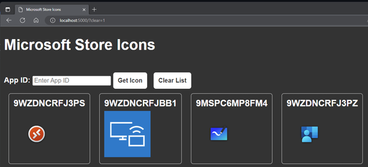

# Microsoft Store Icon Downloader

This Flask app allows you to download icon files for a given Microsoft Store app ID.



## Usage

1. Run the app with docker:

    ```bash
    docker run --rm --name my_container -p 5000:5000 ghcr.io/mrwyss/msstoreappicon:latest
    ```

2. browse to <http://localhost:5000>

## Requirements

- docker

## How to use it

1. Find the store app id with winget (``winget search "Microsoft Remote Desktop" --source msstore"``) or in Intune
2. Copy the app ID
3. Paste the app ID in the input field
4. Hower over the icon and click to download

## How it works

The app makes a request to `https://microsoft-store.azurewebsites.net/store/detail/{appid}/image` to get the icon for the given app ID. It then encodes the image data in base64 and converts it to a data URL, which is used to display the image on the page and create a download link.
